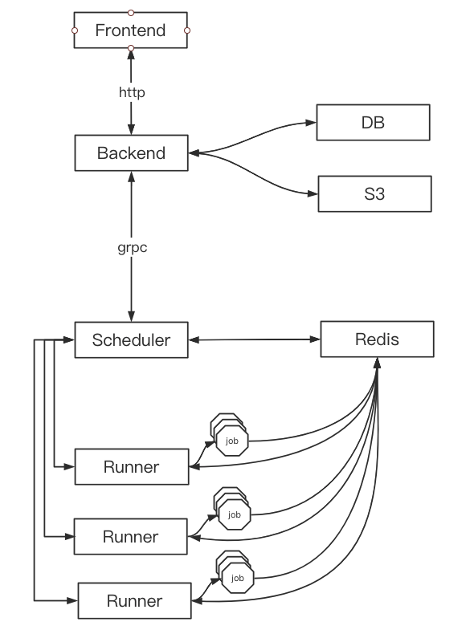

# scheduler

## design

**Scheduler**
1. 监听Runner（心跳）
2. 负责创建, 回收, 重置Runner
3. 分配Job给Runner (Scheduler写入Redis, Runner定时从Redis获取)
4. 获取Runner的状态，Job状态（Redis）
5. 如果某个Runner 心跳timeout, 则该Runner的所有job应更新为failed, 再重新分配(跳转至3)
6. 如果job完成 Runner更新Redis中job状态，stop job的container

**Runner**
1. 定期发给Scheduler心跳(心跳内容包括 Runner状态、。。。）
2. job已完成，写入redis
3. 如果遇到error:
- job container 已经自动退出，向scheduler发送job failed
- job container 还没有退出，则stop container，向scheduler发送job failed

一次任务的交互流程
1. 前端通过UI创建任务

2. 后端转发请求给Scheduler

3. Scheduler查看有无空闲Runner分配Job
- 3.1 如果有分配job（写入到Redis）
- 3.2 如果没有就把job加入队列，等空了再分配

4. Runner开始处理job：
- step1. 创建job container
- step2. 根据commit id pull 代码
- step3. 运行job
